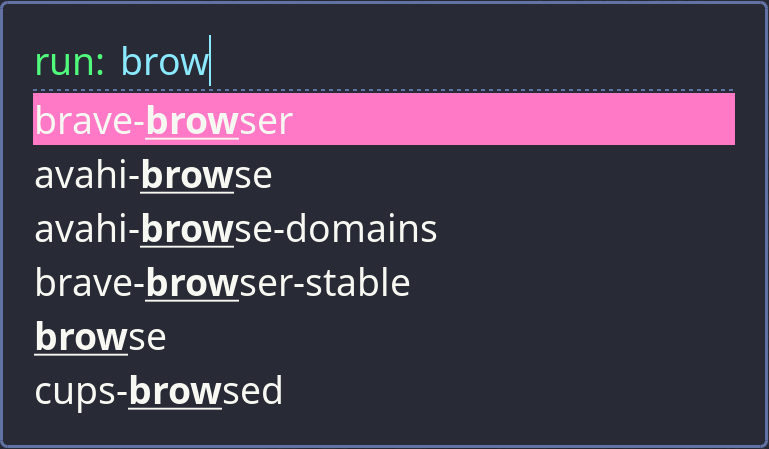

# Dracula for [rofi](https://github.com/davatorium/rofi)

> A dark theme for [rofi](https://github.com/davatorium/rofi).

Rofi is an incredibly customisable launcher, here are some example Dracula themes to get you started.

### theme/config1.rasi

### theme/config2.rasi

## Install

All instructions can be found at [draculatheme.com/rofi](https://draculatheme.com/rofi).

## Team

This theme is maintained by the following person(s) and a bunch of [awesome contributors](https://github.com/dracula/rofi/graphs/contributors).

|  |
| --- |
| [Rafael Lopes](https://github.com/RaphGL) |

## License

[MIT License](./LICENSE)
